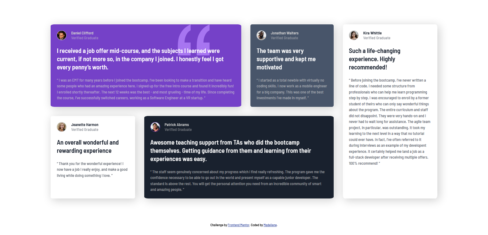
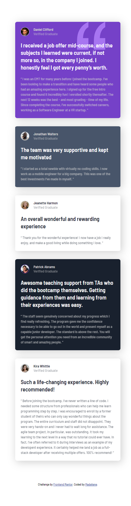

# Frontend Mentor - Testimonials grid section solution

This is a solution to the [Testimonials grid section challenge on Frontend Mentor](https://www.frontendmentor.io/challenges/testimonials-grid-section-Nnw6J7Un7). Frontend Mentor challenges help you improve your coding skills by building realistic projects.

## Table of contents

- [Overview](#overview)
  - [The challenge](#the-challenge)
  - [Screenshot](#screenshot)
  - [Links](#links)
- [My process](#my-process)
  - [Built with](#built-with)
  - [What I learned](#what-i-learned)
  - [Continued development](#continued-development)
  - [Useful resources](#useful-resources)
- [Author](#author)

## Overview

### The challenge

Users should be able to:

- View the optimal layout for the site depending on their device's screen size

### Screenshot

- Desktop view:  

- Mobile view:  

### Links

- Solution URL: [Add solution URL here](https://your-solution-url.com)
- Live Site URL: [Add live site URL here](https://your-live-site-url.com)

## My process

### Built with

- Semantic HTML5 markup
- CSS custom properties
- CSS Grid
- Mobile-first workflow

### What I learned

For this challenge, I decided to attempt it using CSS grids rather than Bootstrap grid system to improve my skillset while getting a feel of the differences in both approaches.

### Continued development

Attempt to explore more different techniques for front end layout design.

### Useful resources

- [Example resource 1](https://www.w3schools.com/css/css_grid_item.asp) - Simple and straight forward guide to building a front end layout using CSS grid.
- [Example resource 2](https://css-tricks.com/almanac/properties/f/float/) - Simple guide to floating the profile picture to the left in order to create the profile section for each testimonial.
- [Example resource 3](https://www.w3schools.com/cssref/css3_pr_box-shadow.asp) - Create box shadow for each testimonial boxes.
- [Example resource 4](https://www.w3schools.com/cssref/css_selectors.asp) - Explore and choose the appropriate CSS selectors in order to avoid having to write additional code where possible.
- [Example resource 5](https://www.w3schools.com/cssref/pr_background-position.asp) - Learned how to add an image at the background and position it as required.

## Author

- Frontend Mentor - [@Madeliyen](https://www.frontendmentor.io/profile/Madeliyen)
